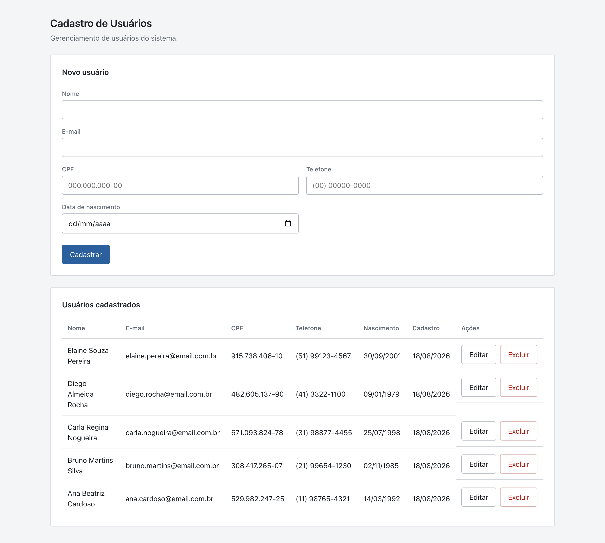
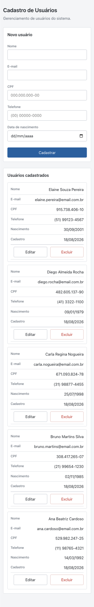

# CRUD de Usuários

Aplicação web de cadastro de usuários desenvolvida como trabalho acadêmico, com
separação explícita entre front-end, back-end e banco de dados. Permite listar,
cadastrar, editar e excluir usuários, com validação em três camadas e as regras de
integridade garantidas pelo próprio banco. Cada camada roda como um processo
independente e se comunica com a seguinte por uma interface bem definida: o
front-end consome a API por HTTP, e a API acessa o MySQL por meio de consultas
parametrizadas.

## Tecnologias utilizadas

Versões efetivamente usadas no desenvolvimento e nos testes.

| Camada | Tecnologia | Versão |
| --- | --- | --- |
| Runtime | Node.js | 20.19.4 |
| Runtime | npm | 10.8.2 |
| Back-end | Express | 4.22.2 |
| Back-end | mysql2 | 3.23.3 |
| Back-end | cors | 2.8.6 |
| Back-end | dotenv | 16.6.1 |
| Front-end | React / React DOM | 18.3.1 |
| Front-end | Vite | 5.4.21 |
| Front-end | @vitejs/plugin-react | 4.7.0 |
| Banco | MySQL (container `mysql:8`) | 8.4.11 |
| Infra | Docker Engine | 28.3.2 |
| Infra | Docker Compose | 2.38.2 |

O back-end usa JavaScript com ES Modules, sem ORM e sem TypeScript. O front-end usa
JavaScript com CSS puro, sem biblioteca de componentes, sem roteador e sem
gerenciador de estado externo. As requisições são feitas com o `fetch` nativo.

## Estrutura da aplicação

```
crud-usuarios/
├── docker-compose.yml     Sobe o MySQL e aplica schema e seed na primeira execução
├── database/              Scripts SQL: criação do banco e carga de dados de teste
├── backend/               API REST em Node.js e Express
│   └── src/
│       ├── server.js          Ponto de entrada: testa a conexão e sobe o servidor
│       ├── app.js             Middlewares globais e montagem das rotas
│       ├── config/            Pool de conexões do MySQL
│       ├── routes/            Declaração dos endpoints
│       ├── controllers/       Leitura da requisição e definição do status HTTP
│       ├── services/          Regras de negócio
│       ├── repositories/      Única camada com SQL
│       ├── validators/        Validação e normalização do payload
│       ├── middlewares/       Tratamento centralizado de erros
│       └── errors/            Classe de erro da aplicação
├── frontend/              Interface em React com Vite
│   └── src/
│       ├── App.jsx            Concentra o estado da página
│       ├── api/               Funções de acesso à API
│       ├── components/        Lista, formulário e diálogo de confirmação
│       ├── utils/             Máscaras, formatação e validação de CPF
│       └── styles/            Variáveis de tema e estilos da aplicação
└── docs/                  Capturas de tela
```

### Separação em camadas do back-end

A API é dividida em rotas, controllers, services, repositories e validators, e cada
camada só conhece a camada imediatamente abaixo dela. As rotas apenas declaram os
endpoints. Os controllers leem a requisição, chamam o service e definem o status HTTP,
sem nunca tocar no banco. Os services concentram as regras de negócio e não conhecem
`req` nem `res`, o que os torna independentes do protocolo HTTP. Os repositories são
o único ponto do sistema onde existe SQL, sempre com prepared statements, o que
elimina a possibilidade de injeção de SQL e concentra em um só arquivo qualquer
mudança de modelagem. Os validators normalizam e validam o payload antes que ele
chegue às regras de negócio.

Essa divisão existe para que uma mudança fique contida. Trocar o MySQL por outro
banco afeta apenas os repositories; mudar o formato da resposta HTTP afeta apenas os
controllers; mudar uma regra de cadastro afeta apenas o service. Sem essa separação,
o mesmo arquivo acumularia acesso a banco, regra de negócio e detalhes de protocolo,
e qualquer alteração exigiria reler tudo.

## Modelo de dados

Banco `crud_usuarios`, tabela `usuarios`. Engine InnoDB, charset `utf8mb4`,
collation `utf8mb4_unicode_ci`.

| Coluna | Tipo | Restrição | Descrição |
| --- | --- | --- | --- |
| `id` | `INT UNSIGNED` | `PRIMARY KEY`, `AUTO_INCREMENT` | Identificador do usuário, gerado pelo banco |
| `nome` | `VARCHAR(120)` | `NOT NULL`, mínimo de 3 caracteres | Nome completo |
| `email` | `VARCHAR(160)` | `NOT NULL`, `UNIQUE`, formato mínimo de e-mail | E-mail de contato |
| `cpf` | `CHAR(11)` | `NOT NULL`, `UNIQUE`, 11 dígitos numéricos | CPF sem máscara, apenas dígitos |
| `telefone` | `VARCHAR(20)` | `NOT NULL` | Telefone com DDD, apenas dígitos |
| `data_nascimento` | `DATE` | `NOT NULL`, anterior à data atual | Data de nascimento |
| `data_cadastro` | `DATETIME` | `NOT NULL`, `DEFAULT CURRENT_TIMESTAMP` | Momento da criação, preenchido pelo banco |
| `data_atualizacao` | `DATETIME` | `NULL`, `ON UPDATE CURRENT_TIMESTAMP` | Momento da última alteração; `NULL` enquanto nunca editado |

### Constraints

| Nome | Regra |
| --- | --- |
| `chk_usuarios_cpf_tamanho` | `CHAR_LENGTH(cpf) = 11` |
| `chk_usuarios_cpf_numerico` | `cpf REGEXP '^[0-9]{11}$'` |
| `chk_usuarios_email_formato` | `email LIKE '%_@_%._%'` |
| `chk_usuarios_nome_tamanho` | `CHAR_LENGTH(TRIM(nome)) >= 3` |

A regra de data de nascimento não futura não pôde ser escrita como CHECK: o MySQL 8
só aceita expressões determinísticas dentro de uma CHECK, e `CURRENT_DATE` muda a
cada dia, o que faz o servidor rejeitar a constraint com o erro 3814. A regra é
aplicada por dois triggers, `trg_usuarios_bi_nascimento` (BEFORE INSERT) e
`trg_usuarios_bu_nascimento` (BEFORE UPDATE), que abortam a operação com
`SIGNAL SQLSTATE '45000'`. São dois porque validar apenas no INSERT deixaria a regra
burlável por uma edição.

### Índices

| Nome | Coluna | Tipo | Motivo |
| --- | --- | --- | --- |
| `PRIMARY` | `id` | Primária | Identidade da linha, usada nas rotas por id |
| `uk_usuarios_email` | `email` | Único | Impede dois cadastros com o mesmo e-mail |
| `uk_usuarios_cpf` | `cpf` | Único | Impede dois cadastros para a mesma pessoa |
| `idx_usuarios_nome` | `nome` | Comum | Desempenho na busca e na ordenação por nome |

## Como executar

### Pré-requisitos

- Node.js 18 ou superior (desenvolvido na 20.19.4)
- Docker e Docker Compose, para subir o banco pelo caminho recomendado
- Alternativamente, um MySQL 8.0.16 ou superior já instalado (as CHECK constraints
  exigem essa versão)

Portas usadas: banco em `3307`, back-end em `3000`, front-end em `5173`.

### 1. Banco de dados

Na raiz do projeto:

```bash
docker compose up -d
```

O container sobe como `mysql-crud`, expõe a porta 3307 do host e executa
automaticamente, na primeira subida, os scripts de `database/` em ordem alfabética:
primeiro `01_schema.sql`, depois `02_seed.sql`. O banco nasce com a tabela criada e
os cinco usuários de teste inseridos. Os dados ficam em um volume nomeado e
sobrevivem a reinícios do container.

Para acompanhar até o banco ficar pronto:

```bash
docker compose ps
```

O status passa a `healthy` quando o healthcheck responde. Para conferir a carga:

```bash
docker exec mysql-crud mysql -uroot -proot -e "SELECT id, nome, email FROM crud_usuarios.usuarios;"
```

Para recomeçar do zero, apagando o volume e forçando a reexecução dos scripts:

```bash
docker compose down -v
```

### 2. Back-end

```bash
cd backend
npm install
```

Copie o arquivo de exemplo. Os valores já correspondem ao banco subido pelo Docker
Compose, então nenhuma edição é necessária:

```bash
cp .env.example .env
```

Conteúdo resultante:

```
DB_HOST=localhost
DB_PORT=3307
DB_USER=root
DB_PASSWORD=root
DB_NAME=crud_usuarios

PORT=3000
CORS_ORIGIN=http://localhost:5173
```

```bash
npm run dev
```

A API sobe em `http://localhost:3000`. O servidor testa a conexão com o banco antes
de escutar: se a conexão falhar, ele registra o motivo e encerra com código 1, em vez
de subir e falhar a cada requisição. Para executar sem o modo de observação de
arquivos, use `npm start`.

### 3. Front-end

```bash
cd frontend
npm install
```

Copie o arquivo de exemplo, também sem necessidade de edição:

```bash
cp .env.example .env
```

Conteúdo resultante:

```
VITE_API_URL=http://localhost:3000/api
```

```bash
npm run dev
```

A interface fica em `http://localhost:5173`. Para gerar a versão de produção:

```bash
npm run build
```

### Alternativa: MySQL já instalado

Se preferir usar um MySQL próprio em vez do container, aplique os scripts
manualmente. Com o servidor rodando na porta padrão 3306:

```bash
mysql -u root -p < database/01_schema.sql
```

```bash
mysql -u root -p < database/02_seed.sql
```

Se o servidor estiver em outro host ou porta, informe explicitamente:

```bash
mysql -h 127.0.0.1 -P 3307 -u root -p < database/01_schema.sql
```

Rode o `02_seed.sql` apenas em um banco vazio: executá-lo duas vezes viola as chaves
únicas de e-mail e CPF. O `01_schema.sql` é idempotente e pode ser reexecutado.

Neste caminho o `backend/.env` precisa ser editado depois de copiado, porque o arquivo
de exemplo aponta para o container: ajuste `DB_HOST`, `DB_PORT`, `DB_USER` e
`DB_PASSWORD` de acordo com a sua instalação (uma instalação local padrão usa a porta
3306).

## Endpoints da API

Prefixo: `/api/usuarios`.

| Método | Rota | Descrição | Códigos de resposta |
| --- | --- | --- | --- |
| `POST` | `/api/usuarios` | Cria um usuário | 201, 400, 409, 500 |
| `GET` | `/api/usuarios` | Lista todos, do mais recente para o mais antigo | 200, 500 |
| `GET` | `/api/usuarios/:id` | Busca um usuário pelo id | 200, 400, 404, 500 |
| `PUT` | `/api/usuarios/:id` | Atualiza um usuário | 200, 400, 404, 409, 500 |
| `DELETE` | `/api/usuarios/:id` | Remove um usuário | 204, 400, 404, 500 |

Significado dos códigos: 400 para dados inválidos ou id não numérico, 404 para
usuário inexistente, 409 para e-mail ou CPF já cadastrado, 500 para erro inesperado.
O `DELETE` responde 204 sem corpo.

### Exemplo de requisição

`POST /api/usuarios`

```json
{
  "nome": "Fernando Lima Costa",
  "email": "fernando.costa@email.com.br",
  "cpf": "111.222.333-96",
  "telefone": "(11) 93333-4444",
  "data_nascimento": "1990-05-20"
}
```

CPF e telefone são aceitos com ou sem máscara e gravados apenas com dígitos. O e-mail
é gravado em minúsculas. Campos não previstos no corpo são ignorados, e
`data_cadastro` nunca é aceita do cliente: quem preenche é o banco.

Resposta `201 Created`:

```json
{
  "id": 6,
  "nome": "Fernando Lima Costa",
  "email": "fernando.costa@email.com.br",
  "cpf": "11122233396",
  "telefone": "11933334444",
  "data_nascimento": "1990-05-20",
  "data_cadastro": "2026-08-18 21:33:30",
  "data_atualizacao": null
}
```

### Exemplo de resposta de erro

Todos os erros usam o mesmo formato. O campo `detalhes` aparece quando o erro é
atribuível a campos específicos, tanto em 400 quanto em 409, e permite ao front-end
marcar o campo correspondente.

`400 Bad Request`:

```json
{
  "erro": {
    "mensagem": "Dados inválidos",
    "detalhes": [
      { "campo": "cpf", "mensagem": "CPF inválido" },
      { "campo": "data_nascimento", "mensagem": "Data de nascimento não pode ser futura" }
    ]
  }
}
```

`409 Conflict`:

```json
{
  "erro": {
    "mensagem": "Email já cadastrado",
    "detalhes": [
      { "campo": "email", "mensagem": "Email já cadastrado" }
    ]
  }
}
```

Erros sem campo atribuível vêm apenas com `mensagem`.

## Validações aplicadas

A mesma regra é verificada em mais de uma camada de propósito. Cada camada tem um
papel diferente: o front-end dá retorno imediato, o back-end é a autoridade sobre a
regra de negócio, e o banco é a última linha de defesa.

### No front-end

Executadas antes de qualquer requisição, com a mensagem exibida abaixo do campo e a
borda destacada:

- Todos os campos são obrigatórios
- Nome com no mínimo 3 caracteres
- E-mail em formato válido
- CPF com dígitos verificadores válidos, conferidos por implementação própria em
  `src/utils/mascaras.js`, sem biblioteca externa
- Telefone com 10 ou 11 dígitos
- Data de nascimento não futura

CPF e telefone recebem máscara conforme o usuário digita e são enviados apenas com
dígitos.

### No back-end

Refeitas integralmente em `src/validators/usuario.validator.js`, porque a validação
do cliente pode ser contornada por qualquer requisição direta à API. Além das
mesmas regras acima, o back-end normaliza os dados (`trim` no nome, e-mail em
minúsculas, apenas dígitos em CPF e telefone), rejeita id não numérico com 400,
ignora campos não previstos e verifica a unicidade de e-mail e CPF antes de gravar,
desconsiderando o próprio registro quando é uma atualização.

### No banco de dados

Garantidas pela estrutura da tabela, valendo inclusive para quem insira dados pelo
terminal do MySQL: `NOT NULL` em todos os campos obrigatórios, `UNIQUE` em e-mail e
CPF, as quatro CHECK constraints de tamanho e formato listadas acima, e os dois
triggers que impedem data de nascimento futura. A violação da chave única também é
tratada pela API, que a converte em 409.

## Capturas de tela

Listagem em desktop:



A mesma tela em 375px de largura, com a tabela convertida em cartões empilhados:


